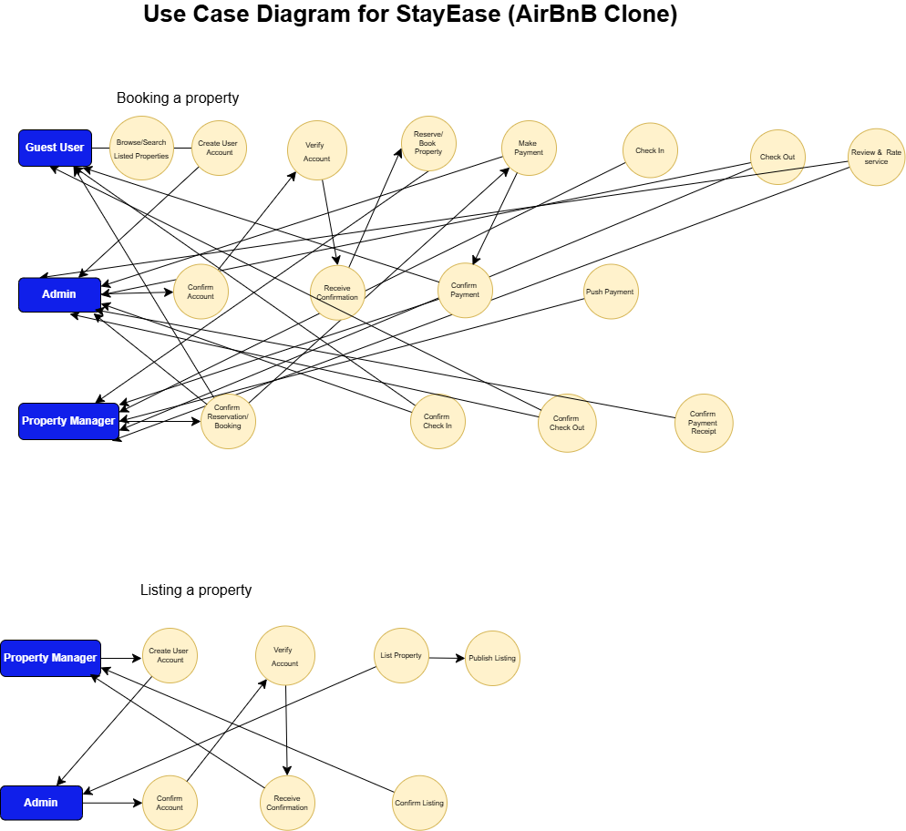

# requirement-analysis

The purpose of this repository is to initiate the documentation requirement of the StayEase project (AirBnB clone)

## What is Requirement Analysis?

Requirement analysis is part of the foundational stage of every Software Development Lifecylce (SDLC). It involves engaging users, sponsors and the development team to establish pain points, needs, expectations and proposed solutions. The process will help eliminate gaps in understanding, provide a scope for the project, the cost and time involved.This requirement analysis seeks to highlight the needs or expectations of stakeholders of StayEase (AirBnB Clone). In essence it is a meeting of the minds session to ensure all stakeholders are on the same level of understanding.

## Why is Requirement Analysis Important?

Requirement Analysis is paramount for the success of any software project because it lays the foundation for all subsequent phases. Its importance cannot be overstated for several reasons:

- **Ensures Stakeholder Satisfaction:** By clearly defining needs upfront, it ensures the final product aligns with what users and clients actually want and expect, leading to higher satisfaction.
- **Reduces Project Risks:** Ambiguous or poorly defined requirements are a leading cause of project failure, cost overruns, and delays. Thorough analysis mitigates these risks by identifying potential issues early.
- **Improves Project Planning:** Clear requirements provide a solid basis for accurate project planning, including scope definition, effort estimation, resource allocation, and scheduling.
- **Facilitates Design and Development:** Well-defined requirements serve as a blueprint for designers and developers, guiding them in creating a system that meets the specified functionalities and performance criteria.
- **Enhances Quality Assurance:** Test cases and quality assurance efforts are directly derived from requirements. Clear requirements make it easier to verify that the developed software functions correctly and meets all specified criteria.
- **Minimizes Rework and Costs:** Addressing issues during the requirements phase is significantly cheaper and less time-consuming than fixing them during development, testing, or after deployment.
- **Fosters Communication:** It acts as a common language between technical and non-technical stakeholders, ensuring everyone is on the same page regarding the project's objectives.

## Key Activities in Requirement Analysis

The Requirement Analysis phase comprises several interconnected activities, each vital for ensuring a comprehensive and accurate understanding of the system to be built:

- **Requirement Gathering:**

  - This initial activity involves identifying and engaging with all relevant stakeholders (users, clients, domain experts, business analysts, etc.). The goal is to understand their needs, expectations, and the problems the software aims to solve. It's about casting a wide net to collect all potential requirements from various sources.

- **Requirement Elicitation:**

  - This is the process of actively extracting requirements from stakeholders. It employs various techniques to draw out information that might not be immediately obvious. Common elicitation techniques include:
    - **Interviews:** One-on-one discussions with stakeholders.
    - **Workshops/Brainstorming Sessions:** Collaborative meetings to gather ideas and reach consensus.
    - **Surveys/Questionnaires:** Collecting input from a large number of stakeholders.
    - **Observation:** Watching users perform their tasks in their natural environment.
    - **Prototyping:** Creating mock-ups or early versions of the system to get feedback.
    - **Document Analysis:** Reviewing existing system documentation, business rules, and regulations.

- **Requirement Documentation:**

  - Once elicited, requirements must be formally recorded in a clear, unambiguous, and consistent manner. This creates a single source of truth for the project. Common documentation artifacts include:
    - **Software Requirements Specification (SRS) Document:** A comprehensive document detailing all functional and non-functional requirements.
    - **User Stories:** Short, simple descriptions of a feature from the perspective of an end-user.
    - **Use Cases:** Detailed descriptions of how users interact with the system to achieve a goal.
    - **Requirement Traceability Matrix:** Links requirements to design, code, and test cases.

- **Requirement Analysis and Modeling:**

  - This activity involves scrutinizing the gathered requirements to identify conflicts, ambiguities, incompleteness, and redundancies. It's about refining and organizing the raw requirements into a coherent set. Modeling techniques are often used to visualize and understand the relationships between different requirements and system components. Examples include:
    - **Data Flow Diagrams (DFDs):** Illustrate how data moves through a system.
    - **UML Diagrams (e.g., Use Case Diagrams, Class Diagrams, Sequence Diagrams):** Provide different perspectives on system behavior and structure.
    - **State Diagrams:** Show the different states an object can have and how it transitions between them.
    - **Process Modeling:** Mapping out business processes to identify system touchpoints.

- **Requirement Validation:**

  - The final critical step is to ensure that the documented requirements are correct, complete, consistent, feasible, and truly reflect the stakeholders' needs. This activity aims to catch errors before design and development begin. Techniques include:

    - **Reviews and Walkthroughs:** Stakeholders and team members review the documented requirements.
    - **Prototyping/Mock-ups:** Presenting visual representations to stakeholders for feedback.
    - **Testing against Requirements:** Planning how requirements will be tested later in the SDLC.
    - **Scenario Analysis:** Walking through various user scenarios to ensure all paths are covered.

    ## Types of Requirements

### Functional Requirements

- Functional requirements descibe what the system should do.
- Example, User loggins and how they will be authenticated

### Non-Functional Requirements

- Non-functional requirements describe how the system should perform.
- Example, loading time and responsiveness

## Use Case Diagrams

Use Case Diagram Example for a Booking System:

Below is a Use Case Diagram illustrating core functionalities for a generic booking management system, similar to a hotel or flight booking application. It depicts the primary actors and the key interactions they have with the system.

Use Case Diagrams are behavioral Unified Modeling Language (UML) diagrams that provide a high-level, graphical representation of how users (actors) interact with a system to achieve specific goals (use cases). They show the functionality of a system from the user's perspective, without delving into the internal details of how that functionality is implemented.

## Benefits of Use Case Diagrams:

- **Clarity and Simplicity:** They offer a straightforward way to understand the system's functionality from a user's point of view, making them accessible to both technical and non-technical stakeholders.
- **Scope Definition:** They clearly define the boundaries of the system and what functionalities it will (and will not) provide.
- **Communication Tool:** Use case diagrams serve as an excellent communication tool between stakeholders, analysts, designers, and developers, fostering a shared understanding of system requirements.
- **Foundation for Testing:** Each use case can be a basis for developing test cases, ensuring that all defined functionalities are thoroughly validated.
- **User-Centric Design:** They promote a user-centric approach to design by focusing on the interactions and goals of the end-users.

## Acceptance Criteria

Acceptance Criteria are a set of conditions that a software system, or a specific feature within it, must satisfy to be accepted by a user, a customer, or other authorized stakeholders. They are the "conditions of satisfaction" that define precisely when a piece of work is complete and correct from the perspective of the business and end-users.

They are typically written in a clear, unambiguous, and testable format, often following the Given/When/Then (GWT) structure, making them understandable by both technical and non-technical team members.

## The importance of Acceptance Criteria in Requirement Analysis

Acceptance Criteria play a pivotal role in the Requirement Analysis phase and throughout the SDLC:

- **Clarifies Requirements:** They eliminate ambiguity by providing precise details on the expected behavior of a feature, leaving no room for misinterpretation.
- **Defines "Done":** They provide a clear, objective benchmark for when a feature or user story is considered complete and ready for acceptance.
- **Guides Testing:** QA engineers can directly translate acceptance criteria into test cases, ensuring comprehensive testing that directly verifies stakeholder needs.
- **Manages Expectations:** By explicitly stating what will and will not be delivered, they help manage stakeholder expectations and prevent scope creep.
- **Facilitates Communication:** They serve as a common language, ensuring developers, testers, and business stakeholders have a shared understanding of what needs to be built.
- **Reduces Rework:** By catching potential misunderstandings early in the requirements phase, they significantly reduce the need for costly rework later in the development cycle.

## Example Acceptance Criteria: Checkout Feature

Let's consider a `Checkout` feature in a booking management system (like a hotel booking app).

**User Story:**
As a user, I want to securely complete my booking so that I can receive confirmation and ensure my reservation is finalized.

**Acceptance Criteria (for the Checkout feature):**

- **Scenario 1: Successful Payment and Booking Confirmation**

  - **Given** the user is on the Checkout page with valid booking details (e.g., selected room, dates, guest info) and has entered valid payment information (e.g., credit card number, expiry, CVV).
  - **When** the user clicks the "Confirm Booking" button.
  - **Then** the system securely processes the payment.
  - **And** the system displays a "Booking Confirmed" page with a unique booking ID.
  - **And** an automated booking confirmation email is sent to the user's registered email address, containing all booking details.
  - **And** the booked room's availability is immediately updated in the system's inventory.
  - **And** the booking details are accessible in the user's "My Bookings" section.

- **Scenario 2: Invalid Payment Details**

  - **Given** the user is on the Checkout page with valid booking details.
  - **When** the user enters invalid payment information (e.g., incorrect card number, expired date, wrong CVV) and clicks "Confirm Booking".
  - **Then** the system does not process the payment.
  - **And** the system displays a clear, user-friendly error message indicating the specific payment issue (e.g., "Invalid card number," "Card expired").
  - **And** the user remains on the Checkout page, allowing them to correct the details.

- **Scenario 3: Payment Gateway Failure**
  - **Given** the user is on the Checkout page with valid booking and payment details.
  - **When** the user clicks "Confirm Booking" and the payment gateway experiences an outage or error.
  - **Then** the system does not process the payment.
  - **And** the system displays an informative error message indicating a temporary issue (e.g., "Payment system currently unavailable. Please try again later or contact support.").
  - **And** the booking is not finalized, and the room's availability remains unchanged.
